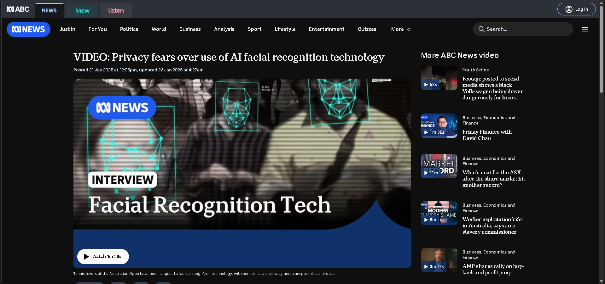
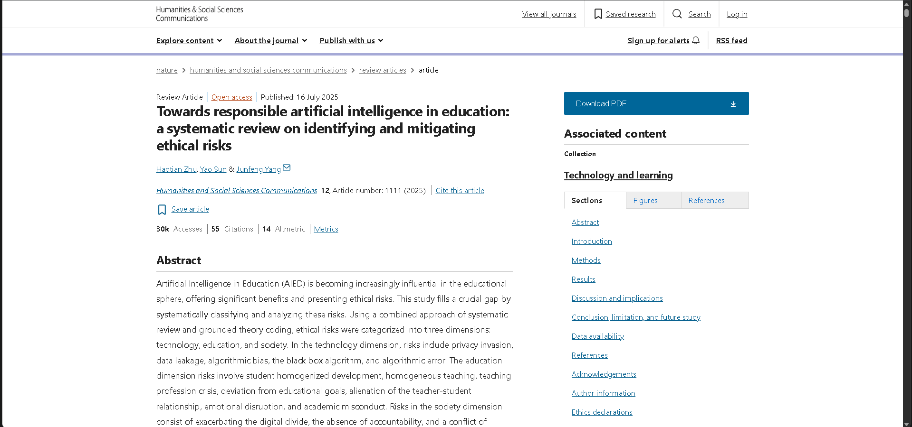
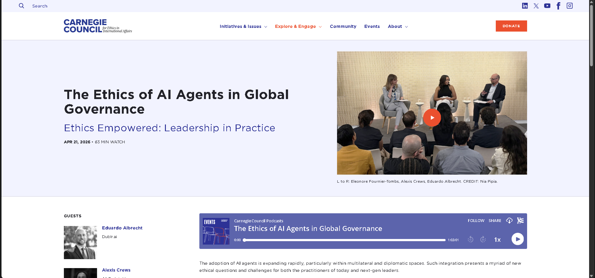
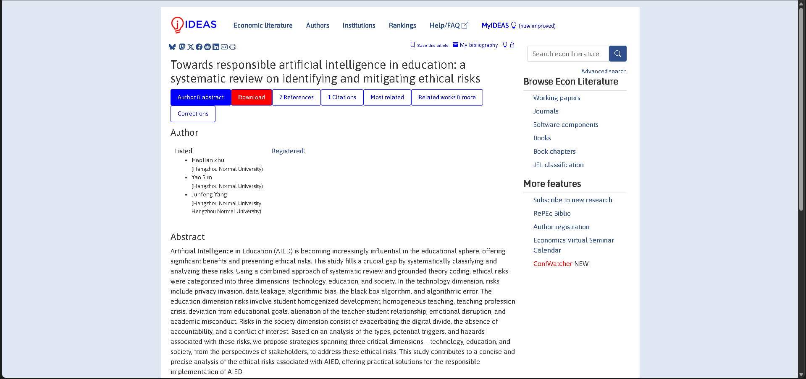

# E-portfolio 2: Ethical Theory

COIT11223 ICT Ethics and Governance in Society

A collection of four artefacts showing what I learned about ethical theories and their use in ICT.

## Artefact 1: Facial recognition at the Australian Open

*Figure 1. Facial recognition at the Australian Open (ABC News 2025).*

[View the artefact](https://www.abc.net.au/news/2025-01-21/privacy-fears-over-use-of-ai-facial-recognition-technology/104843460)

### Summary of the artefact

ABC News reports that spectators at the 2025 Australian Open were scanned with facial-recognition technology. The short video raises questions about whether visitors understood how their biometric data was collected, stored and used. Unlike an ordinary CCTV image, a facial template can identify a person, so consent and transparency matter (ABC News 2025).

### Justification and reflection

I chose this because venue security does not automatically justify scanning everyone. Social contract theory says people accept rules when they are fair and protect their rights (Quinn 2020). Vague data collection weakens that agreement because spectators cannot make an informed choice. I think facial recognition is only ethical when it is necessary, clearly explained, used for one purpose and deleted quickly. Without those safeguards, spectators carry the privacy risk while the venue receives the benefit.

---

## Artefact 2: Ethical risks of AI in education

*Figure 2. Ethical risks of AI in education (Zhu, Sun & Yang 2025).*

[View the artefact](https://www.nature.com/articles/s41599-025-05252-6)

### Summary of the artefact

Zhu, Sun and Yang review research on artificial intelligence in education and group the ethical risks into technology, education and society. The problems include privacy invasion, data leakage, algorithmic bias, opaque decisions and academic misconduct. Their review shows that an educational tool can be useful while still creating risks for students and teachers (Zhu, Sun & Yang 2025, p. 1).

### Justification and reflection

I selected this article because AI is common in student life, but the ethical boundary is not always obvious. Virtue ethics asks what an honest person would do (Quinn 2020). A student can use AI to test ideas or locate information, but should check sources, disclose assistance and keep responsibility for the final judgement. Presenting generated work as entirely personal hides the authoring process and weakens trust between students and teachers.

---

## Artefact 3: AI agents in global governance

*Figure 3. AI agents in global governance (Carnegie Council for Ethics in International Affairs 2026).*

[View the artefact](https://www.carnegiecouncil.org/media/video/ethics-ai-agents-global-governance)

### Summary of the artefact

A Carnegie Council panel examines the use of AI agents in diplomacy and government. The speakers discuss human oversight, transparency, external audits and the risk that automated systems may flatten political judgement or exclude marginalised voices. They argue that public institutions need practical checks before AI-generated material shapes policy or services (Carnegie Council for Ethics in International Affairs 2026).

### Justification and reflection

Efficiency alone does not justify automated government decisions. Rule utilitarianism judges the effects of following a general rule (Quinn 2020). Allowing AI agents to make policy without review may save time, but repeated errors and hidden bias could harm many people. A better rule would let AI sort information or draft documents while an accountable person makes the final decision and explains the tool's role. This keeps some efficiency without removing human responsibility.

---

## Artefact 4: Workshop reflection - submitting GenAI work

*Figure 4. Week 4 workshop material on ethics and ethical theories (Galea 2026).*

[View the workshop material](http://moodle.cqu.edu.au)

### Summary of the artefact

The Week 4 workshop introduced Kantianism, act and rule utilitarianism, social contract theory and virtue ethics. I focused on the scenario about submitting university work produced with generative AI. The scenario asks whether saving time can justify presenting machine-generated material as a student's own work, especially when the assessment is meant to show individual learning (Galea 2026).

### Justification and reflection

Act utilitarianism might count the student's short-term benefit, but Kantianism gives a stronger answer. If everyone claimed generated work as their own, assessment could not measure learning, so the rule cannot be universalised (Quinn 2020). It also uses teachers and honest classmates as a means to obtain a grade. Virtue ethics points to honesty. I left the activity believing that disclosed AI assistance may support learning, but it should not replace my reasoning.

---

## References

ABC News 2025, *Privacy fears over use of AI facial recognition technology*, video, 21 January, viewed 7 August 2026, <https://www.abc.net.au/news/2025-01-21/privacy-fears-over-use-of-ai-facial-recognition-technology/104843460>.

Carnegie Council for Ethics in International Affairs 2026, *The ethics of AI agents in global governance*, video, 21 April, viewed 7 August 2026, <https://www.carnegiecouncil.org/media/video/ethics-ai-agents-global-governance>.

Galea, G 2026, *Week 4 lecture: Ethics and ethical theories*, COIT11223: ICT Ethics and Governance in Society, CQUniversity, viewed 7 August 2026, <http://moodle.cqu.edu.au>.

Quinn, MJ 2020, *Ethics for the Information Age*, 8th edn, Pearson, United States.

Zhu, H, Sun, Y & Yang, J 2025, 'Towards responsible artificial intelligence in education: a systematic review on identifying and mitigating ethical risks', *Humanities and Social Sciences Communications*, vol. 12, article 1111, pp. 1-14, DOI: 10.1057/s41599-025-05252-6.

## Generative AI declaration

No generative AI tools were used to plan, research, draft, edit or proofread this assessment. All work was completed independently by S M Shahriar Alam. I have referenced, considered and cited all sources.
